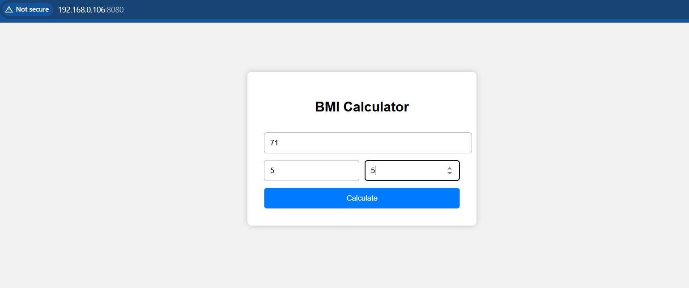
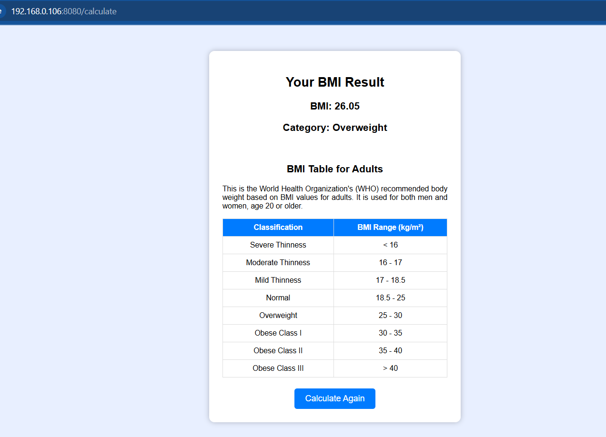

# 🏋️‍♀️ BMI Calculator Web Application

A simple **BMI (Body Mass Index) Calculator** built with **Python and Flask**.  
Users can calculate their BMI by entering their weight and height, and the app provides an interpretation of their BMI category.

---

## Directory Structure

```
├── app.py
├── readme.md
├── requirements.txt
├── ss
│   ├── bmi_calculate.PNG
│   └── bmi.PNG
└── templates
    ├── index.html
    └── result.html

```


1️⃣ Clone the Repository**

git clone https://github.com/Komal-Madiwal/bmi.git
cd bmi


2️⃣ Install Dependencies

pip install -r requirements.txt


3️⃣ Run Locally

python app.py


4️⃣ Open in Browser

Copy and paste this link in your browser:

http://192.168.0.106:8080/


# Features

Enter weight (kg) and height (ft/in) to calculate BMI

Dynamic BMI calculation using Flask backend

BMI category interpretation: Underweight, Normal, Overweight, Obese


## 📷 Screenshots






